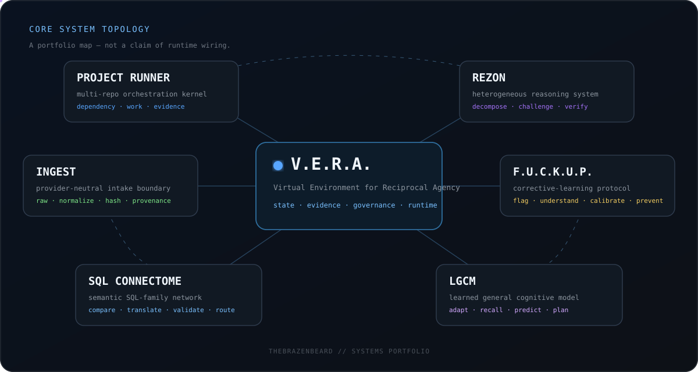
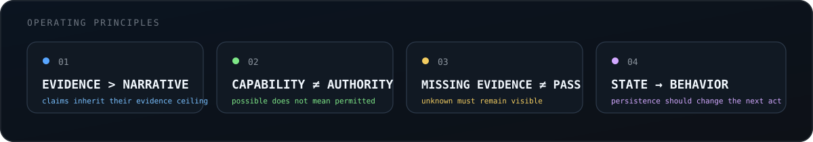

 

**I build systems where models, tools, durable state, evidence, and authority have to remain distinguishable from the stories told about them.**

---

## System topology

> The map is a portfolio-level relationship view, not a claim that every repository is already wired into one live runtime.

---

## Core systems

<table>
<tr>
<td width="50%" valign="top">

### [V.E.R.A.](https://github.com/thebrazenbeard/vera)
**Virtual Environment for Reciprocal Agency**

Cross-cutting architecture for governed state, evidence, runtime cohesion, and durable AI-system behavior.

</td>
<td width="50%" valign="top">

### [Project Runner](https://github.com/thebrazenbeard/project-runner)

A multi-repository orchestration kernel for deciding what changed, what depends on it, what work is justified, what may execute, and what evidence proves completion.

</td>
</tr>

<tr>
<td width="50%" valign="top">

### [Rezon](https://github.com/thebrazenbeard/rezon)

Heterogeneous reasoning through decomposition, multiple reasoning methods, adversarial challenge, retrieval, provenance verification, integration, and persistent subject/state tracking.

</td>
<td width="50%" valign="top">

### [The F.U.C.K.U.P. Protocol](https://github.com/thebrazenbeard/fuckup)

**Flag · Understand · Calibrate · Know · Unlearn · Prevent**

Corrective learning that turns failures into bounded, testable, reversible prevention mechanisms.

</td>
</tr>

<tr>
<td width="50%" valign="top">

### [Ingest](https://github.com/thebrazenbeard/ingest)

A provider-neutral intake boundary that preserves exact raw material, normalizes explicitly, hashes deterministically, keeps provenance attached, and refuses to confuse intake with truth.

</td>
<td width="50%" valign="top">

### [SQL Connectome](https://github.com/thebrazenbeard/sql-connectome)

A semantic network for understanding, comparing, translating, validating, routing, and safely executing SQL-family languages without pretending every dialect has the same semantics.

</td>
</tr>

<tr>
<td colspan="2" valign="top">

### [LGCM](https://github.com/thebrazenbeard/lgcm)

An experimental learned general cognitive model for persistent continual learning: adaptation, context recall, predictive modeling, recovery of prior internal models, and bounded planning.

</td>
</tr>
</table>

---

## Selected systems

<table>
<tr>
<td width="33%" valign="top">

### [DriftGuard](https://github.com/thebrazenbeard/driftguard)

Deterministic regression admission for AI agents, binding behavioral measurements to explicit policy, accepted baselines, evidence, and exact results.

</td>
<td width="33%" valign="top">

### [WorkBridgeMCP](https://github.com/thebrazenbeard/WorkBridgeMCP)

A bounded MCP workstation bridge: useful real-machine capability without quietly turning tool access into unrestricted authority.

</td>
<td width="33%" valign="top">

### [Pro-Run](https://github.com/thebrazenbeard/pro-run)

Durable continuous execution for tool-using language models, with recoverable runs, constrained tool calls, idempotent effects, and reconciliation instead of blind replay.

</td>
</tr>
</table>

---

## Operating principles

> Interesting hypotheses deserve hostile review, not protection.

---

## Toolchain

  

`Python` · `Go` · `TypeScript` · `JavaScript` · `PowerShell` · `Bash` · `Docker` · `PostgreSQL` · `GitHub Actions` · `MCP`

---

## GitHub activity

  
  

  

---

### Build it. Test it. Try to break the claim before the claim breaks the system.

systems · provenance · orchestration · continual learning · evidence

